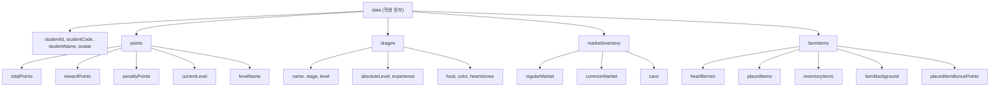

# 🌱 그라운드(GROWND) API 개발자 문서

> [!NOTE]
> 이 문서는 그라운드 플랫폼의 공식 API 문서 3개를 통합 정리한 개발자 참고 문서입니다.
> - [통합 사용 가이드](https://slashpage.com/grownd/93nzyxmdv9rdnmwk6r45)
> - [포인트 부여 API 가이드](https://slashpage.com/grownd/grownd_API)
> - [학생 정보 조회 API 가이드](https://slashpage.com/grownd/qrx6zk258y9n3mv314y5)

---

## 📑 목차

1. [개요](#1-개요)
2. [공통 사항](#2-공통-사항)
3. [포인트 부여 API](#3-포인트-부여-api)
4. [학생 정보 조회 API](#4-학생-정보-조회-api)
5. [에러 처리](#5-에러-처리)
6. [코드 예제 (통합)](#6-코드-예제-통합)
7. [응답 데이터 상세 스키마](#7-응답-데이터-상세-스키마)

---

## 1. 개요

**그라운드(GROWND)**는 학생 관리 시스템(학급 경영 플랫폼)으로, 외부 애플리케이션이 API를 통해 학생 데이터와 연동할 수 있도록 지원합니다.

### 지원 기능

| 기능 | 설명 |
|------|------|
| ✅ **포인트 부여 API** | 학생에게 리워드 포인트 부여 / 페널티 포인트 차감 |
| ✅ **학생 정보 조회 API** | 포인트, 레벨, 드래곤, 마켓 아이템, 텃밭 정보 등 조회 |

### 제공 API 엔드포인트 요약

| 메서드 | 엔드포인트 | 설명 |
|--------|-----------|------|
| `POST` | `/api/v1/classes/{classId}/students/{studentCode}/points` | 포인트 부여/차감 |
| `GET` | `/api/v1/classes/{classId}/students/{studentCode}` | 학생 정보 조회 |

---

## 2. 공통 사항

### 기본 정보

| 항목 | 값 |
|------|-----|
| **Base URL** | `https://growndcard.com` |
| **프로토콜** | HTTPS |
| **인증 방식** | API Key (HTTP Header) |
| **Content-Type** | `application/json` (POST 요청 시) |

### 인증 방식

모든 API 요청에 `X-API-Key` 헤더를 포함해야 합니다.

```
X-API-Key: YOUR_GROWND_API_KEY
```

> [!IMPORTANT]
> API 키는 `sk_live_` 접두사로 시작합니다. 키는 그라운드 웹사이트에서 발급 받을 수 있습니다.

### API 키 발급 절차

1. [그라운드](https://growndcard.com)에 로그인
2. 설정 메뉴에서 API 키 발급
3. 발급된 키를 안전하게 저장

### 필요 권한

| API | 필요 권한 |
|-----|----------|
| 포인트 부여 API | (기본 권한) |
| 학생 정보 조회 API | `readStudents` |

### URL 경로 파라미터

| 파라미터 | 타입 | 설명 |
|---------|------|------|
| `classId` | `string` | 학급(클래스) ID |
| `studentCode` | `number` | 학생 번호 (출석번호) |

---

## 3. 포인트 부여 API

외부 애플리케이션에서 학생들에게 포인트를 부여하거나 차감할 수 있습니다.

### 엔드포인트

```
POST /api/v1/classes/{classId}/students/{studentCode}/points
```

### 요청 헤더

| 헤더 | 값 | 필수 |
|------|-----|------|
| `Content-Type` | `application/json` | ✅ |
| `X-API-Key` | `YOUR_GROWND_API_KEY` | ✅ |

### 요청 Body

```json
{
  "type": "reward",
  "points": 10,
  "description": "퀴즈 정답",
  "source": "MyApp",
  "metadata": {}
}
```

| 필드 | 타입 | 필수 | 설명 |
|------|------|------|------|
| `type` | `"reward"` \| `"penalty"` | ✅ | `reward`: 포인트 부여, `penalty`: 포인트 차감 |
| `points` | `number` | ✅ | 부여/차감할 포인트 수 |
| `description` | `string` | ✅ | 포인트 부여/차감 사유 |
| `source` | `string` | ❌ | 포인트 발생 출처 (예: 앱 이름) |
| `metadata` | `object` | ❌ | 추가 메타데이터 |

> [!TIP]
> 포인트 부여 시 **텃밭 보너스**가 적용될 수 있습니다. 응답의 `bonusApplied` 필드에서 보너스 포인트를 확인하세요.

### 성공 응답 (200 OK)

```json
{
  "success": true,
  "data": {
    "recordId": "rec_xyz789",
    "studentId": "stu_abc123",
    "studentCode": 2,
    "type": "reward",
    "pointsAwarded": 10,
    "bonusApplied": 0,
    "totalPoints": 150.5,
    "currentLevel": 5,
    "leveledUp": false,
    "createdAt": "2025-11-12T01:23:45.000Z"
  },
  "message": "포인트가 성공적으로 반영되었습니다."
}
```

### 응답 필드 설명

| 필드 | 타입 | 설명 |
|------|------|------|
| `recordId` | `string` | 포인트 기록 ID |
| `studentId` | `string` | 학생 고유 ID |
| `studentCode` | `number` | 학생 번호 |
| `type` | `string` | `reward` 또는 `penalty` |
| `pointsAwarded` | `number` | 실제 부여/차감된 포인트 |
| `bonusApplied` | `number` | 텃밭 보너스로 추가된 포인트 |
| `totalPoints` | `number` | 포인트 반영 후 총 포인트 |
| `currentLevel` | `number` | 현재 레벨 |
| `leveledUp` | `boolean` | 레벨업 발생 여부 |
| `createdAt` | `string` (ISO 8601) | 기록 생성 시간 |

### cURL 예시

```bash
curl -X POST \
  "https://growndcard.com/api/v1/classes/YOUR_CLASS_ID/students/2/points" \
  -H "Content-Type: application/json" \
  -H "X-API-Key: YOUR_API_KEY" \
  -d '{
    "type": "reward",
    "points": 10,
    "description": "퀴즈 정답"
  }'
```

---

## 4. 학생 정보 조회 API

학생의 포인트, 레벨, 드래곤 정보, 마켓 보유 상품, 텃밭 정보를 조회할 수 있습니다.

### 엔드포인트

```
GET /api/v1/classes/{classId}/students/{studentCode}
```

### 요청 헤더

| 헤더 | 값 | 필수 |
|------|-----|------|
| `X-API-Key` | `YOUR_GROWND_API_KEY` | ✅ |

> [!NOTE]
> GET 요청이므로 `Content-Type` 헤더는 불필요합니다.

### 조회 가능한 정보

| 카테고리 | 조회 항목 |
|----------|----------|
| **기본 정보** | 학생 ID, 학생 번호, 이름, 아바타 |
| **포인트 & 레벨** | 총 포인트, 리워드 포인트, 페널티 포인트, 레벨, 레벨 이름 |
| **드래곤** | 이름, 단계, 레벨, 절대 레벨, 경험치, 먹이, 색상, 하트스톤 |
| **마켓 인벤토리** | 일반 마켓 상품, 공동구매 상품, 케이브 상품 |
| **텃밭 (Farm)** | 하트베리, 배치 아이템, 인벤토리 아이템, 배경, 보너스 포인트 |

### 성공 응답 (200 OK)

```json
{
  "success": true,
  "data": {
    "studentId": "stu_abc123",
    "studentCode": 2,
    "studentName": "홍길동",
    "avatar": "/avatars/a1.png",
    "points": {
      "totalPoints": 150,
      "rewardPoints": 180,
      "penaltyPoints": 30,
      "currentLevel": 4,
      "levelName": "아스파라거스"
    },
    "dragon": {
      "name": "불꽃이",
      "stage": "baby",
      "level": 3,
      "absoluteLevel": 8,
      "experience": 45,
      "food": 12,
      "color": "red",
      "heartstones": 5
    },
    "marketInventory": {
      "totalItems": 12,
      "regularMarket": {
        "totalCount": 5,
        "products": [
          { "productName": "연필 세트", "productEmoji": "✏️" },
          { "productName": "지우개", "productEmoji": "🧹" }
        ]
      },
      "commonMarket": {
        "totalCount": 4,
        "products": [
          { "productName": "간식 세트", "productEmoji": "🍪" }
        ]
      },
      "cave": {
        "totalCount": 3,
        "products": [
          { "productName": "드래곤 먹이", "productEmoji": "🥩" }
        ]
      }
    },
    "farmItems": {
      "heartBerries": 25,
      "placedItems": [
        { "itemId": "item_001", "name": "분수", "emoji": "⛲", "x": 2, "y": 3 },
        { "itemId": "item_002", "name": "나무", "emoji": "🌳", "x": 4, "y": 2 }
      ],
      "inventoryItems": [
        { "itemId": "item_003", "name": "꽃", "emoji": "🌸", "quantity": 5 },
        { "itemId": "item_004", "name": "벤치", "emoji": "🪑", "quantity": 2 }
      ],
      "farmBackground": "spring",
      "placedItemBonusPoints": 2.5
    }
  },
  "message": "학생 정보 조회에 성공했습니다."
}
```

### cURL 예시

```bash
curl -X GET \
  "https://growndcard.com/api/v1/classes/YOUR_CLASS_ID/students/2" \
  -H "X-API-Key: YOUR_API_KEY"
```

---

## 5. 에러 처리

### 공통 에러 응답 형식

모든 API에서 에러 발생 시 동일한 형식으로 응답합니다.

```json
{
  "success": false,
  "error": {
    "code": "error_code",
    "message": "에러 메시지",
    "details": {}
  }
}
```

### 주요 에러 코드

| 에러코드 | 설명 | 발생 상황 |
|---------|------|----------|
| `student_not_found` | 학생을 찾을 수 없음 | 존재하지 않는 `studentCode` 사용 시 |
| `insufficient_permissions` | 권한 부족 | 필요 권한이 없는 API 키 사용 시 |
| `invalid_api_key` | 잘못된 API 키 | 유효하지 않은 키 사용 시 |

### 에러 응답 예시

````carousel
**학생 미발견 에러**
```json
{
  "success": false,
  "error": {
    "code": "student_not_found",
    "message": "해당 학생 번호에 해당하는 학생을 찾을 수 없습니다.",
    "details": {
      "classId": "NP0hetJ3wyQKFtRnFeftmPiy8Dl3_2",
      "studentCode": 99
    }
  }
}
```
<!-- slide -->
**권한 부족 에러**
```json
{
  "success": false,
  "error": {
    "code": "insufficient_permissions",
    "message": "학생 정보 조회 권한이 없습니다.",
    "details": {
      "requiredPermission": "readStudents"
    }
  }
}
```
````

---

## 6. 코드 예제 (통합)

아래는 **포인트 부여 + 학생 정보 조회**를 모두 사용하는 통합 예제입니다.

### JavaScript (Node.js)

```javascript
const fetch = require('node-fetch');

const API_KEY = 'YOUR_API_KEY';
const BASE_URL = 'https://growndcard.com';
const CLASS_ID = 'YOUR_CLASS_ID';

// ── 포인트 부여 ──
async function awardPoints(studentCode, points, description) {
  const response = await fetch(
    `${BASE_URL}/api/v1/classes/${CLASS_ID}/students/${studentCode}/points`,
    {
      method: 'POST',
      headers: {
        'Content-Type': 'application/json',
        'X-API-Key': API_KEY
      },
      body: JSON.stringify({
        type: 'reward',
        points,
        description,
        source: 'MyApp'
      })
    }
  );

  const data = await response.json();
  if (!response.ok) {
    throw new Error(`API Error: ${data.error.message}`);
  }
  return data.data;
}

// ── 학생 정보 조회 ──
async function getStudentInfo(studentCode) {
  const response = await fetch(
    `${BASE_URL}/api/v1/classes/${CLASS_ID}/students/${studentCode}`,
    {
      method: 'GET',
      headers: { 'X-API-Key': API_KEY }
    }
  );

  const data = await response.json();
  if (!response.ok) {
    throw new Error(`API Error: ${data.error.message}`);
  }
  return data.data;
}

// ── 사용 예시 ──
async function main() {
  try {
    // 1. 포인트 부여
    const awardResult = await awardPoints(2, 10, '퀴즈 정답');
    console.log('포인트 부여 성공:', awardResult.totalPoints);

    // 2. 학생 정보 조회
    const student = await getStudentInfo(2);
    console.log('학생:', student.studentName);
    console.log('총 포인트:', student.points.totalPoints);
    console.log('레벨:', student.points.currentLevel);

    if (student.dragon) {
      console.log('드래곤:', student.dragon.name);
      console.log('드래곤 레벨:', student.dragon.absoluteLevel);
    }
  } catch (error) {
    console.error('에러:', error);
  }
}

main();
```

### Python

```python
import requests

API_KEY = 'YOUR_API_KEY'
BASE_URL = 'https://growndcard.com'
CLASS_ID = 'YOUR_CLASS_ID'


def award_points(student_code, points, description):
    """학생에게 포인트 부여"""
    url = f'{BASE_URL}/api/v1/classes/{CLASS_ID}/students/{student_code}/points'
    response = requests.post(
        url,
        headers={
            'Content-Type': 'application/json',
            'X-API-Key': API_KEY
        },
        json={
            'type': 'reward',
            'points': points,
            'description': description,
            'source': 'MyApp'
        }
    )
    response.raise_for_status()
    return response.json()['data']


def get_student_info(student_code):
    """학생 정보 조회"""
    url = f'{BASE_URL}/api/v1/classes/{CLASS_ID}/students/{student_code}'
    response = requests.get(
        url,
        headers={'X-API-Key': API_KEY}
    )
    response.raise_for_status()
    return response.json()['data']


# 사용 예시
if __name__ == '__main__':
    # 1. 포인트 부여
    result = award_points(2, 10, '퀴즈 정답')
    print(f"포인트 부여 성공: {result['totalPoints']}")

    # 2. 학생 정보 조회
    student = get_student_info(2)
    print(f"학생: {student['studentName']}")
    print(f"총 포인트: {student['points']['totalPoints']}")
    print(f"레벨: {student['points']['currentLevel']} ({student['points']['levelName']})")

    if student['dragon']:
        print(f"드래곤: {student['dragon'].get('name', '이름 없음')}")
        print(f"드래곤 레벨: {student['dragon']['absoluteLevel']}")

    print(f"마켓 상품 수: {student['marketInventory']['totalItems']}개")
    print(f"하트베리: {student['farmItems']['heartBerries']}개")
```

### TypeScript (React/Next.js)

```typescript
// ── 타입 정의 ──

interface AwardPointsRequest {
  type: 'reward' | 'penalty';
  points: number;
  description: string;
  source?: string;
  metadata?: Record<string, any>;
}

interface AwardPointsResponse {
  success: boolean;
  data?: {
    recordId: string;
    studentCode: number;
    pointsAwarded: number;
    totalPoints: number;
    currentLevel: number;
    leveledUp: boolean;
    createdAt: string;
  };
  message?: string;
}

interface StudentInfoResponse {
  success: boolean;
  data?: {
    studentId: string;
    studentCode: number;
    studentName: string;
    avatar?: string;
    points: {
      totalPoints: number;
      rewardPoints: number;
      penaltyPoints: number;
      currentLevel: number;
      levelName: string;
    };
    dragon: {
      name?: string;
      stage: string;
      level: number;
      absoluteLevel: number;
      experience: number;
      food: number;
      color?: string;
      heartstones: number;
    } | null;
    marketInventory: {
      totalItems: number;
      regularMarket: {
        totalCount: number;
        products: Array<{ productName: string; productEmoji?: string }>;
      };
      commonMarket: {
        totalCount: number;
        products: Array<{ productName: string; productEmoji?: string }>;
      };
      cave: {
        totalCount: number;
        products: Array<{ productName: string; productEmoji?: string }>;
      };
    };
    farmItems: {
      heartBerries: number;
      placedItems: Array<{
        itemId: string;
        name: string;
        emoji: string;
        x: number;
        y: number;
      }>;
      inventoryItems: Array<{
        itemId: string;
        name: string;
        emoji: string;
        quantity?: number;
      }>;
      farmBackground?: string;
      placedItemBonusPoints?: number;
    };
  };
  message?: string;
}

// ── 통합 API 클라이언트 ──

class GroundApiClient {
  private apiKey: string;
  private baseUrl: string;
  private classId: string;

  constructor(apiKey: string, classId: string) {
    this.apiKey = apiKey;
    this.classId = classId;
    this.baseUrl = 'https://growndcard.com';
  }

  async awardPoints(
    studentCode: number,
    request: AwardPointsRequest
  ): Promise<AwardPointsResponse> {
    const url = `${this.baseUrl}/api/v1/classes/${this.classId}/students/${studentCode}/points`;
    const response = await fetch(url, {
      method: 'POST',
      headers: {
        'Content-Type': 'application/json',
        'X-API-Key': this.apiKey
      },
      body: JSON.stringify(request)
    });
    const data = await response.json();
    if (!response.ok) {
      throw new Error(data.error?.message || 'API 호출 실패');
    }
    return data;
  }

  async getStudentInfo(studentCode: number): Promise<StudentInfoResponse> {
    const url = `${this.baseUrl}/api/v1/classes/${this.classId}/students/${studentCode}`;
    const response = await fetch(url, {
      method: 'GET',
      headers: { 'X-API-Key': this.apiKey }
    });
    const data = await response.json();
    if (!response.ok) {
      throw new Error(data.error?.message || 'API 호출 실패');
    }
    return data;
  }
}
```

### PHP

```php
<?php

function awardPoints($studentCode, $points, $description) {
    $apiKey = 'YOUR_API_KEY';
    $classId = 'YOUR_CLASS_ID';
    $baseUrl = 'https://growndcard.com';

    $url = "{$baseUrl}/api/v1/classes/{$classId}/students/{$studentCode}/points";
    $data = [
        'type'        => 'reward',
        'points'      => $points,
        'description' => $description
    ];

    $options = [
        'http' => [
            'method'  => 'POST',
            'header'  => [
                'Content-Type: application/json',
                "X-API-Key: {$apiKey}"
            ],
            'content' => json_encode($data)
        ]
    ];
    $context = stream_context_create($options);
    $response = file_get_contents($url, false, $context);

    if ($response === false) {
        throw new Exception('API 호출 실패');
    }
    $result = json_decode($response, true);
    if (!$result['success']) {
        throw new Exception($result['error']['message']);
    }
    return $result['data'];
}

function getStudentInfo($studentCode) {
    $apiKey = 'YOUR_API_KEY';
    $classId = 'YOUR_CLASS_ID';
    $baseUrl = 'https://growndcard.com';

    $url = "{$baseUrl}/api/v1/classes/{$classId}/students/{$studentCode}";
    $options = [
        'http' => [
            'method' => 'GET',
            'header' => ["X-API-Key: {$apiKey}"]
        ]
    ];
    $context = stream_context_create($options);
    $response = file_get_contents($url, false, $context);

    if ($response === false) {
        throw new Exception('API 호출 실패');
    }
    $result = json_decode($response, true);
    if (!$result['success']) {
        throw new Exception($result['error']['message']);
    }
    return $result['data'];
}
```

---

## 7. 응답 데이터 상세 스키마

### 학생 정보 조회 - 전체 응답 구조



### `points` 객체

| 필드 | 타입 | 설명 |
|------|------|------|
| `totalPoints` | `number` | 총 포인트 (리워드 - 페널티) |
| `rewardPoints` | `number` | 누적 리워드 포인트 |
| `penaltyPoints` | `number` | 누적 페널티 포인트 |
| `currentLevel` | `number` | 현재 레벨 |
| `levelName` | `string` | 레벨 이름 (예: "아스파라거스") |

### `dragon` 객체 (nullable)

| 필드 | 타입 | 설명 |
|------|------|------|
| `name` | `string?` | 드래곤 이름 (없을 수 있음) |
| `stage` | `string` | 성장 단계 (예: `"baby"`) |
| `level` | `number` | 현재 단계 내 레벨 |
| `absoluteLevel` | `number` | 전체 절대 레벨 |
| `experience` | `number` | 경험치 |
| `food` | `number` | 보유 먹이 수 |
| `color` | `string?` | 드래곤 색상 |
| `heartstones` | `number` | 보유 하트스톤 수 |

### `marketInventory` 객체

| 필드 | 타입 | 설명 |
|------|------|------|
| `totalItems` | `number` | 전체 보유 상품 수 |
| `regularMarket` | `object` | 일반 마켓 상품 |
| `commonMarket` | `object` | 공동구매 상품 |
| `cave` | `object` | 케이브 상품 |

각 마켓 하위 구조:

| 필드 | 타입 | 설명 |
|------|------|------|
| `totalCount` | `number` | 해당 마켓의 보유 상품 수 |
| `products` | `array` | 상품 목록 |
| `products[].productName` | `string` | 상품 이름 |
| `products[].productEmoji` | `string?` | 상품 이모지 |

### `farmItems` 객체 (텃밭)

| 필드 | 타입 | 설명 |
|------|------|------|
| `heartBerries` | `number` | 보유 하트베리 수 |
| `placedItems` | `array` | 텃밭에 배치된 아이템 |
| `inventoryItems` | `array` | 텃밭 인벤토리 아이템 |
| `farmBackground` | `string?` | 텃밭 배경 (예: `"spring"`) |
| `placedItemBonusPoints` | `number?` | 배치 아이템 보너스 포인트 |

**배치 아이템 (placedItems)**:

| 필드 | 타입 | 설명 |
|------|------|------|
| `itemId` | `string` | 아이템 ID |
| `name` | `string` | 아이템 이름 |
| `emoji` | `string` | 아이템 이모지 |
| `x` | `number` | X 좌표 |
| `y` | `number` | Y 좌표 |

**인벤토리 아이템 (inventoryItems)**:

| 필드 | 타입 | 설명 |
|------|------|------|
| `itemId` | `string` | 아이템 ID |
| `name` | `string` | 아이템 이름 |
| `emoji` | `string` | 아이템 이모지 |
| `quantity` | `number?` | 보유 수량 |

---

> [!WARNING]
> **보안 권장사항**: API 키는 서버 사이드에서만 사용하세요. 프론트엔드(클라이언트) 코드에 직접 노출하지 마세요. 환경 변수 또는 서버 프록시를 통해 관리하는 것을 권장합니다.

---

*문서 작성일: 2026-03-14 | 원본 출처: [그라운드 Slashpage](https://slashpage.com/grownd)*
